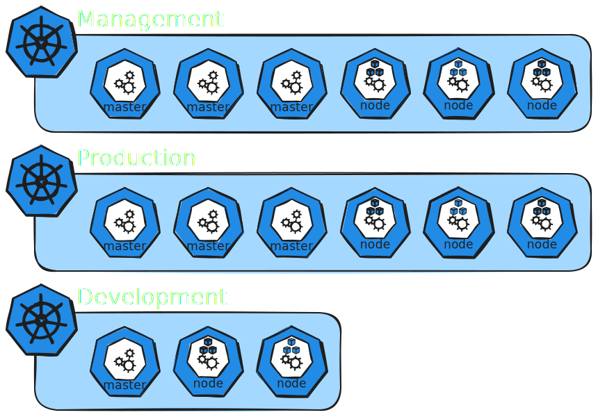

<figure markdown="1">

</figure>

=== "Management"

    ```yaml linenums="1"
    apiVersion: kind.x-k8s.io/v1alpha4
    kind: Cluster
    name: management
    nodes:
    - role: control-plane
    - role: control-plane
    - role: worker
    - role: worker
    - role: worker
    ```

=== "Production"

    ```yaml linenums="1"
    apiVersion: kind.x-k8s.io/v1alpha4
    kind: Cluster
    name: production
    nodes:
    - role: control-plane
    - role: control-plane
    - role: worker
    - role: worker
    - role: worker
    ```

=== "Development"

    ```yaml linenums="1"
    apiVersion: kind.x-k8s.io/v1alpha4
    kind: Cluster
    name: development
    nodes:
    - role: control-plane
    - role: worker
    - role: worker
    ```

```shell hl_lines="1-3" 
kind create cluster --config production.yaml
kind create cluster --config development.yaml
kind create cluster --config management.yaml
```

```shell hl_lines="1" 
kubectx kind-management
```

```shell hl_lines="1-2" 
export GIT_TOKEN=<TOKEN>
export GIT_REPO=https://gitea.mathod.fr/mathod/argocd/
```

!!! Info
    !!! Warning "Your repository should not be empty (need atleast a README.md)"

    === "ArgoCD"

        ```shell hl_lines="1" 
        argocd-autopilot repo bootstrap
        ```

        !!! test

    === "ArgoCD HA"

        ```shell hl_lines="1" 
        argocd-autopilot repo bootstrap --app https://github.com/argoproj-labs/argocd-autopilot/manifests/ha
        ```
    
    === "ArgoCD Recover"

        ```shell hl_lines="1" 
        argocd-autopilot repo bootstrap --recover
        ```


    ??? OUTPUT
        ```shell hl_lines="1"
        argocd-autopilot repo bootstrap --app https://github.com/argoproj-labs/argocd-autopilot/manifests/ha
        INFO cloning repo: https://gitea.mathod.fr/mathod/argocd.git
        Enumerating objects: 3, done.
        Counting objects: 100% (3/3), done.
        Total 3 (delta 0), reused 0 (delta 0), pack-reused 0 (from 0)
        INFO using revision: "", installation path: ""
        INFO using context: "kind-management", namespace: "argocd"
        INFO applying bootstrap manifests to cluster...
        namespace/argocd created
        I1119 06:07:22.680092   57567 warnings.go:110] "Warning: unrecognized format \"int64\""
        customresourcedefinition.apiextensions.k8s.io/applications.argoproj.io created
        I1119 06:07:22.972433   57567 warnings.go:110] "Warning: unrecognized format \"int64\""
        customresourcedefinition.apiextensions.k8s.io/applicationsets.argoproj.io created
        I1119 06:07:23.000688   57567 warnings.go:110] "Warning: unrecognized format \"int64\""
        customresourcedefinition.apiextensions.k8s.io/appprojects.argoproj.io created
        serviceaccount/argocd-application-controller created
        serviceaccount/argocd-applicationset-controller created
        serviceaccount/argocd-dex-server created
        serviceaccount/argocd-notifications-controller created
        serviceaccount/argocd-redis-ha created
        serviceaccount/argocd-redis-ha-haproxy created
        serviceaccount/argocd-repo-server created
        serviceaccount/argocd-server created
        role.rbac.authorization.k8s.io/argocd-application-controller created
        role.rbac.authorization.k8s.io/argocd-applicationset-controller created
        role.rbac.authorization.k8s.io/argocd-dex-server created
        role.rbac.authorization.k8s.io/argocd-notifications-controller created
        role.rbac.authorization.k8s.io/argocd-redis-ha created
        role.rbac.authorization.k8s.io/argocd-redis-ha-haproxy created
        role.rbac.authorization.k8s.io/argocd-server created
        clusterrole.rbac.authorization.k8s.io/argocd-application-controller created
        clusterrole.rbac.authorization.k8s.io/argocd-applicationset-controller created
        clusterrole.rbac.authorization.k8s.io/argocd-server created
        rolebinding.rbac.authorization.k8s.io/argocd-application-controller created
        rolebinding.rbac.authorization.k8s.io/argocd-applicationset-controller created
        rolebinding.rbac.authorization.k8s.io/argocd-dex-server created
        rolebinding.rbac.authorization.k8s.io/argocd-notifications-controller created
        rolebinding.rbac.authorization.k8s.io/argocd-redis-ha created
        rolebinding.rbac.authorization.k8s.io/argocd-redis-ha-haproxy created
        rolebinding.rbac.authorization.k8s.io/argocd-server created
        clusterrolebinding.rbac.authorization.k8s.io/argocd-application-controller created
        clusterrolebinding.rbac.authorization.k8s.io/argocd-applicationset-controller created
        clusterrolebinding.rbac.authorization.k8s.io/argocd-server created
        configmap/argocd-cm created
        configmap/argocd-cmd-params-cm created
        configmap/argocd-gpg-keys-cm created
        configmap/argocd-notifications-cm created
        configmap/argocd-rbac-cm created
        configmap/argocd-redis-ha-configmap created
        configmap/argocd-redis-ha-health-configmap created
        configmap/argocd-ssh-known-hosts-cm created
        configmap/argocd-tls-certs-cm created
        secret/argocd-notifications-secret created
        secret/argocd-secret created
        service/argocd-applicationset-controller created
        service/argocd-dex-server created
        service/argocd-metrics created
        service/argocd-notifications-controller-metrics created
        I1119 06:07:23.759488   57567 warnings.go:110] "Warning: spec.SessionAffinity is ignored for headless services"
        service/argocd-redis-ha created
        service/argocd-redis-ha-announce-0 created
        service/argocd-redis-ha-announce-1 created
        service/argocd-redis-ha-announce-2 created
        service/argocd-redis-ha-haproxy created
        service/argocd-repo-server created
        service/argocd-server created
        service/argocd-server-metrics created
        deployment.apps/argocd-applicationset-controller created
        deployment.apps/argocd-dex-server created
        deployment.apps/argocd-notifications-controller created
        deployment.apps/argocd-redis-ha-haproxy created
        deployment.apps/argocd-repo-server created
        deployment.apps/argocd-server created
        statefulset.apps/argocd-application-controller created
        statefulset.apps/argocd-redis-ha-server created
        networkpolicy.networking.k8s.io/argocd-application-controller-network-policy created
        networkpolicy.networking.k8s.io/argocd-applicationset-controller-network-policy created
        networkpolicy.networking.k8s.io/argocd-dex-server-network-policy created
        networkpolicy.networking.k8s.io/argocd-notifications-controller-network-policy created
        networkpolicy.networking.k8s.io/argocd-redis-ha-proxy-network-policy created
        networkpolicy.networking.k8s.io/argocd-redis-ha-server-network-policy created
        networkpolicy.networking.k8s.io/argocd-repo-server-network-policy created
        networkpolicy.networking.k8s.io/argocd-server-network-policy created
        secret/argocd-repo-creds created

        INFO pushing bootstrap manifests to repo
        INFO applying argo-cd bootstrap application
        I1119 06:08:19.009703   57567 warnings.go:110] "Warning: metadata.finalizers: \"resources-finalizer.argocd.argoproj.io\": prefer a domain-qualified finalizer name including a path (/) to avoid accidental conflicts with other finalizer writers"
        application.argoproj.io/autopilot-bootstrap created
        INFO running argocd login to initialize argocd config
        'admin:login' logged in successfully
        Context 'autopilot' updated

        INFO argocd initialized. password: kZMMpfTCiCgOe8O3
        INFO run:

            kubectl port-forward -n argocd svc/argocd-server 8080:80
        ```

        ```shell title="check ha" hl_lines="1"
        kubectl get pods -o wide --sort-by=.metadata.name
        NAME                                                READY   STATUS    RESTARTS   AGE   IP           NODE                 NOMINATED NODE   READINESS GATES
        argocd-application-controller-0                     1/1     Running   0          13m   10.244.5.5   management-worker2   <none>           <none>
        argocd-applicationset-controller-7b6ff755dc-8hg4v   1/1     Running   0          13m   10.244.5.2   management-worker2   <none>           <none>
        argocd-dex-server-584f7d88dc-gqcd9                  1/1     Running   0          13m   10.244.3.2   management-worker3   <none>           <none>
        argocd-notifications-controller-67cdd486c6-jx7gt    1/1     Running   0          13m   10.244.4.2   management-worker    <none>           <none>
        argocd-redis-ha-haproxy-6dcff5ff4-4ntsg             1/1     Running   0          13m   10.244.5.3   management-worker2   <none>           <none>
        argocd-redis-ha-haproxy-6dcff5ff4-rcs7m             1/1     Running   0          13m   10.244.4.3   management-worker    <none>           <none>
        argocd-redis-ha-haproxy-6dcff5ff4-v55hm             1/1     Running   0          13m   10.244.3.3   management-worker3   <none>           <none>
        argocd-redis-ha-server-0                            3/3     Running   0          13m   10.244.3.5   management-worker3   <none>           <none>
        argocd-redis-ha-server-1                            3/3     Running   0          10m   10.244.4.5   management-worker    <none>           <none>
        argocd-redis-ha-server-2                            3/3     Running   0          10m   10.244.5.7   management-worker2   <none>           <none>
        argocd-repo-server-5dc55fd9c6-nwrzf                 1/1     Running   0          13m   10.244.3.4   management-worker3   <none>           <none>
        argocd-repo-server-5dc55fd9c6-wjnhv                 1/1     Running   0          13m   10.244.5.4   management-worker2   <none>           <none>
        argocd-server-645f948d84-8xstl                      1/1     Running   0          13m   10.244.5.6   management-worker2   <none>           <none>
        argocd-server-645f948d84-pzmrb                      1/1     Running   0          13m   10.244.4.4   management-worker    <none>           <none>
        ```

```shell
kubens argocd
```

```shell
argocd login --core
Context 'kubernetes' updated
```

??? Cheatcode

    ```shell
    # 1. Vérifier le contexte actuel
    kubectl config current-context
    # Doit afficher: kind-management
    
    # 2. Si besoin, basculer sur management
    kubectl config use-context kind-management
    
    # 3. Créer un répertoire temporaire
    mkdir -p ~/argocd-clusters-config
    cd ~/argocd-clusters-config
    
    # 4. Créer le kubeconfig modifié pour PRODUCTION
    kubectl config view --flatten --minify --context kind-production > production-kubeconfig-temp.yaml
    
    sed 's|server: https://127.0.0.1:[0-9]*|server: https://production-external-load-balancer:6443|g' \
        production-kubeconfig-temp.yaml > production-kubeconfig.yaml
    
    # 5. Créer le kubeconfig modifié pour DEVELOPMENT
    kubectl config view --flatten --minify --context kind-development > development-kubeconfig-temp.yaml
    
    sed 's|server: https://127.0.0.1:[0-9]*|server: https://development-control-plane:6443|g' \
        development-kubeconfig-temp.yaml > development-kubeconfig.yaml
    
    # 6. Extraire les informations pour PRODUCTION
    PROD_SERVER=$(grep "server:" production-kubeconfig.yaml | awk '{print $2}')
    PROD_CA=$(grep "certificate-authority-data:" production-kubeconfig.yaml | awk '{print $2}')
    PROD_CERT=$(grep "client-certificate-data:" production-kubeconfig.yaml | awk '{print $2}')
    PROD_KEY=$(grep "client-key-data:" production-kubeconfig.yaml | awk '{print $2}')
    
    # 7. Créer le secret pour PRODUCTION
    cat <<EOF | kubectl apply -f -
    apiVersion: v1
    kind: Secret
    metadata:
      name: cluster-kind-production
      namespace: argocd
      labels:
        argocd.argoproj.io/secret-type: cluster
    type: Opaque
    stringData:
      name: production
      server: ${PROD_SERVER}
      config: |
        {
          "tlsClientConfig": {
            "insecure": false,
            "caData": "${PROD_CA}",
            "certData": "${PROD_CERT}",
            "keyData": "${PROD_KEY}"
          }
        }
    EOF
    
    # 8. Extraire les informations pour DEVELOPMENT
    DEV_SERVER=$(grep "server:" development-kubeconfig.yaml | awk '{print $2}')
    DEV_CA=$(grep "certificate-authority-data:" development-kubeconfig.yaml | awk '{print $2}')
    DEV_CERT=$(grep "client-certificate-data:" development-kubeconfig.yaml | awk '{print $2}')
    DEV_KEY=$(grep "client-key-data:" development-kubeconfig.yaml | awk '{print $2}')
    
    # 9. Créer le secret pour DEVELOPMENT
    cat <<EOF | kubectl apply -f -
    apiVersion: v1
    kind: Secret
    metadata:
      name: cluster-kind-development
      namespace: argocd
      labels:
        argocd.argoproj.io/secret-type: cluster
    type: Opaque
    stringData:
      name: development
      server: ${DEV_SERVER}
      config: |
        {
          "tlsClientConfig": {
            "insecure": false,
            "caData": "${DEV_CA}",
            "certData": "${DEV_CERT}",
            "keyData": "${DEV_KEY}"
          }
        }
    EOF
    
    # 10. Vérifier les clusters enregistrés
    kubectl get secrets -n argocd -l argocd.argoproj.io/secret-type=cluster
    
    # 11. Tester avec argocd CLI (si installé)
    argocd cluster list
    ```

??? "How it supposed to be"

    ```shell hl_lines="1"
    argocd cluster list
    SERVER                          NAME        VERSION  STATUS      MESSAGE  PROJECT
    https://kubernetes.default.svc  in-cluster  1.34     Successful

    argocd cluster add
    CURRENT  NAME              CLUSTER           SERVER
             kind-development  kind-development  https://127.0.0.1:43459
    *        kind-management   kind-management   https://127.0.0.1:37175
             kind-production   kind-production   https://127.0.0.1:35325

    argocd cluster add kind-production --project production
    WARNING: This will create a service account `argocd-manager` on the cluster referenced by context `kind-production` with full cluster level privileges. Do you want to continue [y/N]? y
    {"level":"info","msg":"ServiceAccount \"argocd-manager\" created in namespace \"kube-system\"","time":"2025-11-17T22:11:06+01:00"}
    {"level":"info","msg":"ClusterRole \"argocd-manager-role\" created","time":"2025-11-17T22:11:06+01:00"}
    {"level":"info","msg":"ClusterRoleBinding \"argocd-manager-role-binding\" created","time":"2025-11-17T22:11:06+01:00"}
    {"level":"info","msg":"Created bearer token secret \"argocd-manager-long-lived-token\" for ServiceAccount \"argocd-manager\"","time":"2025-11-17T22:11:06+01:00"}
    Cluster 'https://127.0.0.1:35325' added

    argocd cluster add kind-development --project development
    WARNING: This will create a service account `argocd-manager` on the cluster referenced by context `kind-development` with full cluster level privileges. Do you want to continue [y/N]? y
    {"level":"info","msg":"ServiceAccount \"argocd-manager\" created in namespace \"kube-system\"","time":"2025-11-17T22:11:23+01:00"}
    {"level":"info","msg":"ClusterRole \"argocd-manager-role\" created","time":"2025-11-17T22:11:23+01:00"}
    {"level":"info","msg":"ClusterRoleBinding \"argocd-manager-role-binding\" created","time":"2025-11-17T22:11:23+01:00"}
    {"level":"info","msg":"Created bearer token secret \"argocd-manager-long-lived-token\" for ServiceAccount \"argocd-manager\"","time":"2025-11-17T22:11:23+01:00"}
    Cluster 'https://127.0.0.1:43459' added
    ```

```shell
argocd-autopilot project create production --dest-server 
argocd-autopilot project create development --dest-server 
argocd-autopilot project create management --dest-server in-cluster --project management --yes 
```

```shell
argocd-autopilot app create hello-world --app gitea.mathod.fr/mathod/infra/bootstrap/apps/examples -p production --wait-timeout 2m
argocd-autopilot app create hello-world --app gitea.mathod.fr/mathod/infra/bootstrap/apps/examples -p development --wait-timeout 2m

argocd-autopilot app create hello-world --installation-path bootstrap --repo https://gitea.mathod.fr/mathod/infra.git --app bootstrap/apps/examples -p production --wait-timeout 2m
argocd-autopilot app create hello-world --repo https://gitea.mathod.fr/mathod/infra.git --app bootstrap/apps/examples -p development --wait-timeout 2m
```

```shell hl_lines="1"
argocd cluster list
SERVER                          NAME              VERSION  STATUS      MESSAGE                                                  PROJECT
https://127.0.0.1:38013         kind-development           Unknown     Cluster has no applications and is not being monitored.  development
https://127.0.0.1:39635         kind-production            Unknown     Cluster has no applications and is not being monitored.
https://kubernetes.default.svc  in-cluster        1.34     Successful
```

```shell hl_lines="1"
argocd proj list
NAME         DESCRIPTION          DESTINATIONS  SOURCES  CLUSTER-RESOURCE-WHITELIST  NAMESPACE-RESOURCE-BLACKLIST  SIGNATURE-KEYS  ORPHANED-RESOURCES  DESTINATION-SERVICE-ACCOUNTS
default                           *,*           *        */*                         <none>                        <none>          disabled            <none>
development  development project  *,*           *        */*                         <none>                        <none>          disabled            <none>
management   management project   *,*           *        */*                         <none>                        <none>          disabled            <none>
production   production project   *,*           *        */*                         <none>                        <none>          disabled            <none>
```

```shell
kind delete clusters management
kind delete clusters production
kind delete clusters development
```